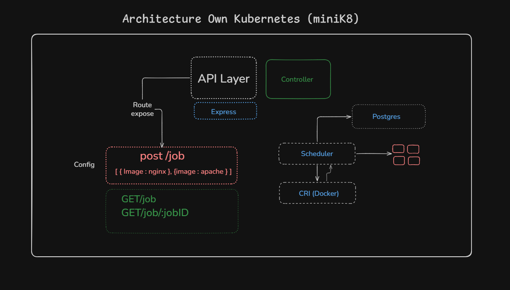

# MiniK8s

A lightweight Kubernetes-like container orchestration system built with Node.js and Docker.



## Tech Stack

- **Runtime**: Node.js with TypeScript
- **Server**: Express.js
- **Database**: PostgreSQL with Drizzle ORM
- **Queue**: BullMQ for job scheduling and workers
- **Container**: Docker via dockerode

## Architecture

MiniK8s implements a simplified Kubernetes-like workflow:

1. **API Server** - Accepts job submissions via REST API
2. **Job Dispatcher** - Moves jobs from `SUBMITTED` → `RUNNABLE` state
3. **CRI (Container Runtime Interface)** - Pulls Docker images and creates containers for `RUNNABLE` jobs

## Job States

```
SUBMITTED → RUNNABLE → RUNNING → SUCCEEDED/FAILED
```

## Getting Started

### Prerequisites

- Node.js
- PostgreSQL
- Redis (for BullMQ)
- Docker

### Installation

```bash
pnpm install
```

### Configuration

Create a `.env` file with your database connection string.

### Commands

| Command            | Description                     |
| ------------------ | ------------------------------- |
| `pnpm dev`         | Start the API server            |
| `pnpm worker`      | Start the scheduler and workers |
| `pnpm db:generate` | Generate Drizzle migrations     |
| `pnpm db:migrate`  | Apply database migrations       |
| `pnpm db:studio`   | Open Drizzle Studio             |

## API Endpoints

### Health Check

```
GET /
```

### Submit Job

```
POST /job
Content-Type: application/json

{
  "image": "nginx:latest",
  "cmd": ["echo", "Hello"]
}
```

## License

ISC
